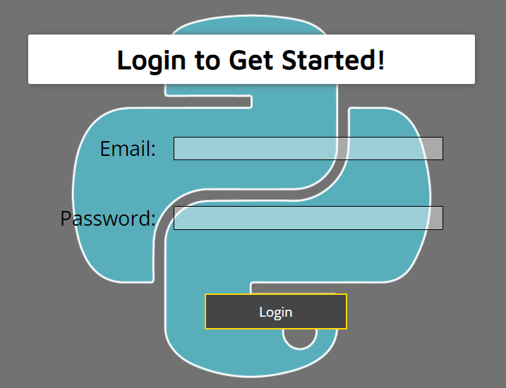
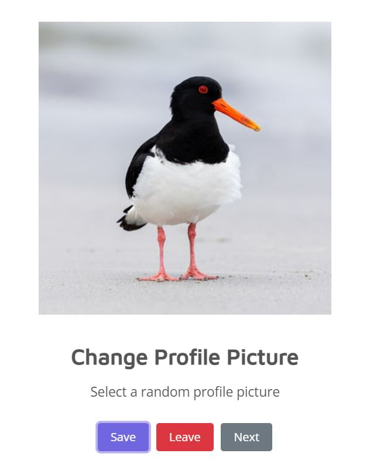
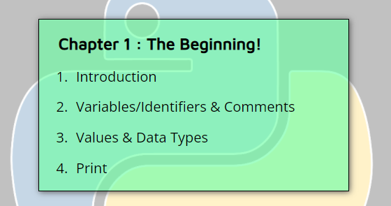
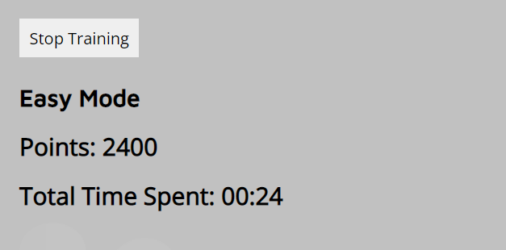
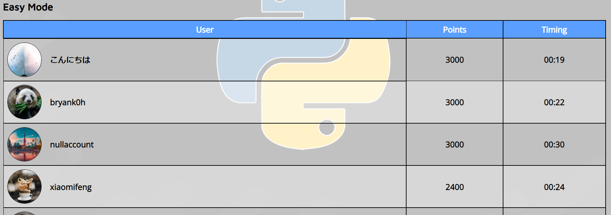
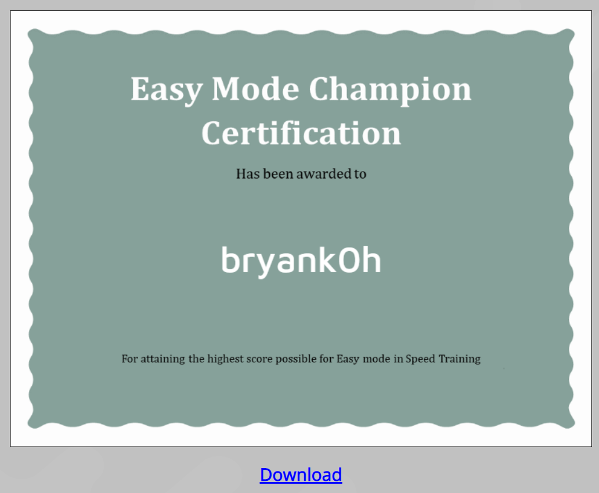
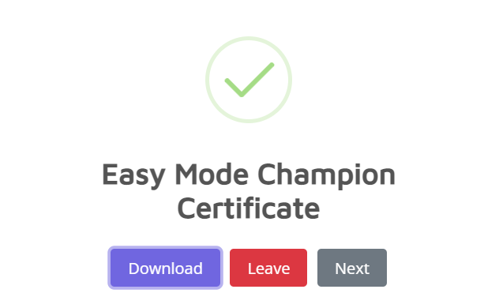

# ID Assignment 2: Learn Python at Ngee Ann Polytechnic
**Team Members: Bryan Koh, Lee Wei Jun Nicholas**

For this assignment, we will be working on a website which educates and teaches students in Ngee Ann Polytechnic about the fundamentals/basics of Python. Our goal is set out to enhance and gamify the experience of learning the Python language, while being able to hone their skills via our web application. Our target audience would be to benefit students of Information Technology, or any related courses that will make use of the language.

Students would be able to use their email to log in to our website. Students get to use two modes: Tutorial Mode and Speed Training Mode. 
In Tutorial Mode, students get to learn the different basic topics at their own pace. Their progress is also saved and completed chapters are highlighted green. 
In Speed Training Mode, it is assumed that Students have already aquired the basic knowledge and this is the mode to challenge themselves. They have an option of two difficulties, easy and standard. Easy mode will be in the form of MCQ questions, while standard mode will be in the form of short Fill-in-the-Blank coding questions. The students' task will be to answer a set of 10 randomized questions correctly under a set time. They will also earn points depending on the time spent for each question (Points become less when more time is used to answer questions).

A certificate will be presented upon completion of either difficulty in Speed Training Mode.

In Speed Training mode, users can also view the leaderboard and see who are in the leading positions.

## Features

- **Feature 1**: Users must log in into their accounts to get started, or create an account with a unique username and an unregistered email. 

- **Feature 2**: Users can select a random profile picture upon clicking the "Change profile picture" button or the profile picture itself. 

- **Feature 3**: In Tutorial Mode, upon completing a chapter and clicking the mark chapter as complete button, their progress will be saved. In the chapter selection menu, completed chapters will be marked green. 

- **Feature 4**: In Speed Training mode, the user's points and time spent will be recorded and saved. This will be utilized in the leaderboard feature which will be explained next. 

- **Feature 5**: The leaderboard in speed training mode displays two categories, Easy mode and Standard mode. The leaderboard is ranked based on number of points earned, then the timing. 

- **Feature 6**: In Speed Training mode, if the user scores the maximum amount of points possible in either Easy mode or Standard mode, a customized certificate will be available for the user to view and download. Design of the certificate differ between Easy mode and Standard mode. 

- **Feature 7**: If the user wants to view their certificates again, they can do so in the main menu page. A button "Download Certificates" is available for the user to download his/her certificates. 

- **Feature 8**: A 'Report a Problem' page is available for users to report issues encoutered, as well as to find contact details. 

## Technologies Used
- Adobe XD  
For creating a wireframe of the website.

- Adobe Illustrator  
Used to design the backgrounds of the website.

- Visual Studio Code -> HTML, CSS & JavaScript  
Used to code the website.

- jQuery  
Used to simplify HTML document traversal, manipulation, event handling, animation and Ajax.

- sweetalert2  
Used for responsive and customizable popup boxes in the website.

- Unsplash Image API  
Used for getting images based on the collections from Unsplash. This is used for the profile picture feature on the website.

- LottieFiles  
Used for some animations in the website.

- restdb.io  
Used to store important data of users.

## Testing 

**1. Login Validation**
   1. Key in non-existing email address/wrong password/wrong email.
   2. Ensure that an error message appears indicating that invalid credentials has been keyed in, hence denying login.

**2. Login Success**
   1. Key in correct email and password.
   2. Ensure that user is successfully logged in and led to main menu page.

**3. Create Account Validation, Part 1**
   1. Key in email address / usernames that has already been registered.
   2. Ensure that error messages appear indicating that email address has been registered, or username has already been taken.

**4. Create Account Validation, Part 2**
   1. Enter password.
   2. Enter non-matching password in the 're-enter password' field.
   3. Ensure that an error message appear indicating that password does not match.

**5. Create Account Validation, Part 3**
   1. Leave any fields blank.
   2. Ensure that there is a popup indicating that required fields must be entered.

**6. Create Account Success**
   1. Fill in a username that has not been taken, as well as an unregistered email.
   2. Enter password and re-enter password correctly.
   3. Ensure that account is created successfully, and user is taken to the main menu.

**7. Entering into website via other pages without logging in**
   1. Enter URL of any pages other than the homepage or create account page, while not logged in.
   2. Ensure that there is an error popup indicating that the user is not logged in.
   3. User is then taken back to the homepage.

**8. While already logged in, the user is at the homepage or create account page**
   1. While already logged in, go to the URL of the homepage or create account page.
   2. Ensure that there is a popup indicating that the user has already been logged in.
   3. User is then taken to the main menu page.

**9. Change Profile Picture, Part 1**
   1. In main menu page, click on either the profile picture or "Change profile picture".
   2. Click Next.
   3. Ensure that a new picture is displayed.

**9. Change Profile Picture, Part 2**
   1. In main menu page, click on either the profile picture or "Change profile picture".
   2. Click Save.
   3. Ensure that all internal links are disabled and not shown on the website, and the user is prompted to wait for the profile picture to update.
   4. Page will reload after the waiting time is complete.

**10. Download Certificates**
   1. In main menu page, click on "Download Certificates".
   2. Ensure that all internal links are disabled and not shown on the website, and a lottie animation is shown indicating to wait.
   3. Once complete, popup will appear for the user to download certificate(s).
   4. Click "Download".
   5. Ensure that certificate is downloaded properly.

**11. Report a Problem, Part 1**
   1. In the "Report a Problem" page, leave the textarea blank.
   2. Click "Report"
   3. Ensure that form is not submitted.

**12. Report a Problem, Part 2**
   1. In the "Report a Problem" page, fill in the textarea.
   2. Click "Report"
   3. Ensure that a thank you popup message appears.

**13. Logout**
   1. In the main menu page, click "Logout"
   2. Ensure that a popup appears indicating that the user has logged out.

**14. Progress saved for Tutorial Mode**
   1. In the tutorial mode page, click on any of the chapters.
   2. At the bottom of the page, click on "End of Chapter XXX. Click here to mark Chapter XXX as complete!".
   3. Ensure all buttons are disabled and not displayed.
   4. Ensure that a popup appears indicating that status has been updated, prompting the user to wait.
   5. Page will reload.
   6. Ensure that the completed chapter is marked with a green background, and the progress bar is updated.
   7. Click on the completed chapter.
   8. Ensure that the completion button at the bottom of the page is not displayed.

**15. 100% Completion Tutorial Mode**
   1. In the tutorial mode page, complete all chapters by clicking on the completion button for each chapter.
   2. Ensure that all chapters are marked with a green background, and a trophy appears with a congratuations message.
   3. Ensure that the progress bar is full.

**16. Reset Completion**
   1. In the tutorial mode page, click on "Reset Completion".
   2. Ensure that all buttons are disabled and not displayed, and a message appears indicating that the progress is being reset.
   3. Ensure that a popup appears that the status has been updated.
   4. The page will reload.
   5. Ensure that no chapters are being marked with a green background.
   6. Ensure that there is no trophy or congratulations message.
   7. Ensure that the progress bar is empty.
   8. Ensure that the completion button appears for all chapters.

**17. Speed Training Easy mode, Part 1**
   1. Click on an option.
   2. Ensure that the selected option remains blue.
   3. Ensure that when the submit button is pressed, the answer is checked and a popup appears indicating whether the answer is correct or not correct.
   4. User is led to the next question.

**18. Speed Training Easy mode, Part 2**
   1. Click on an option.
   2. Click on another option.
   3. Ensure that the previous selected option is deselected, and the new option is selected.

**19. Speed Training Easy mode, Part 3**
   1. Do not select any options.
   2. Click on the submit button.
   3. Ensure that a popup appears prompting the user to answer the question.
   4. Ensure that the timer is still running.

**20. Speed Training Easy mode, Part 4**
   1. Let the time run until no time is left.
   2. Click or do not click on any options.
   3. Click on the submit button.
   4. Ensure that a popup appears indicating that the user has exceeded the time.
   5. User is led to the next question.

**21. Speed Training Standard mode, Part 1**
   1. Fill in all the blanks.
   2. Click on the submit button.
   3. Ensure that a popup appears indicating whether the user has answered correctly or incorrectly.
   4. User is led to the next question.

**22. Speed Training Standard mode, Part 2**
   1. Leave all blanks blank.
   2. Click on the submit button.
   3. Ensure that a popup appears indicating that the user has answered the question wrongly.
   4. User is led to the next question.

**23. Speed Training Standard mode, Part 3**
   1. Let the time run until no time is left.
   2. Click on the submit button.
   3. Ensure that a popup appears indicating that the user has exceeded the time.
   4. User is led to the next question.

**24. Speed Training Results screen (for both easy and standard)**
   1. After completing all 10 questions, ensure that the user is taken to the results screen, showing the points scored and total time taken.
   2. If the user gets the maximum points possible for the particular mode, ensure that a certificate is shown and the user can click on the "Download" button to download the certificate.

**25. Speed Training Leaderboard**
   1. In Speed Training mode page, click on "Leaderboard".
   2. Ensure that there is a lottie animation, indicating that the leaderboard is loading.
   3. Click on either Easy Mode button or Standard Mode button.
   4. Ensure that the respective leaderboard is displayed.
   5. Ensure that the leaderboard is ranked by points scored, followed by time taken.

**26. Entering into another training**
   1. In Speed Training mode, complete a training session.
   2. Click on "Stop Training" at the results page.
   3. Select a difficulty.
   4. Ensure that a popup appears indicating that the page has to reload as a session has been completed previously.

**Other validations**
Ensure that there are no broken links, and all external links are opened on a new tab.
  
## Credits

### Media

### Fonts